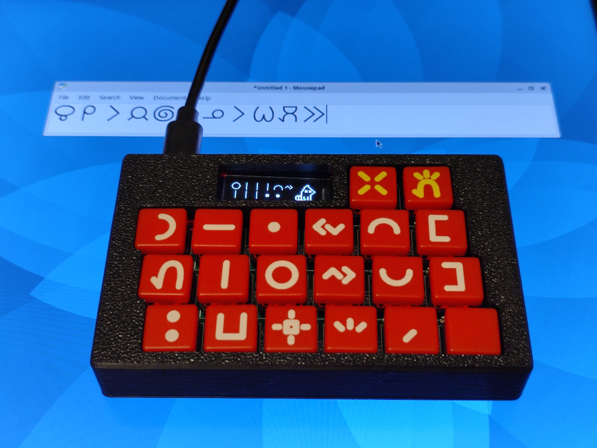

* o anu e toki (Language Selection): [toki pona](README.MD) | **[toki ike Inli (English)](README-EN.MD)**

# ilo nena - Toki Pona Unicode Keyboard with Built-in Wakalito Input Method



ilo nena is a purpose-built keyboard for typing sitelen pona glyph of toki pona into computers. Feature list:

* Built-in [Wakalito](https://sona.pona.la/wiki/Wakalito) input method
* Supports Unicode output with [sitelen pona UCSUR codepoints](https://www.kreativekorp.com/ucsur/charts/sitelen.html)
* Compact form factor: 102mm x 64mm x 18mm
* Supports firmware upgrade via USB
* Fully open source (firmware, PCBA, enclosure, user manual, etc.)
* Cost-optimized for small volume production. Easy to build your own unit

## Usage

1. Install the font "[FairFax HD](https://www.kreativekorp.com/software/fonts/fairfaxhd/)"
2. Which operating system are you using?
	* 🪟 Windows: Install [WinCompose](https://github.com/ell1010/wincompose). ilo nena uses "R_ALT+U+digits" to type Unicode
	* 🐧 Linux: Supported out of the box for most linux distros. ilo nena uses "CTRL+SHIFT+U+digits"
	* 🍎 Apple: Configure and use the built-in "Unicode Hex Input". ilo nena uses "Option+digits"
	* Others: ilo nena has Latin (ASCII) mode that's compatible with all devices. However, it couldn't output Unicode in this mode. You would need a font that supports conversion between Latin to sitelen pona such as FairFax Pona HD.
3. Connect USB cable, one side with ilo nena, another side with your computer
4. Hold the space key to enter the config screen below:
	* 
	* press the "la" key (leftmost column, topmost row) to select the OS. Once done, press the "pana" key (the yellow key on the rightmost column)
5. Launch any text editing software and select the font "FairFax HD". You're all set! Now that you can type sitelen pona with ilo nena!
6. (Optional) Here's how you set the default OS to use upon powering on the ilo nena:
	* Remove power from ilo nena
	* Hold the "weka" key (the yellow key on second column to the right) and connect USB cable.
	* Select configuration with the "la" key and the "luka" key (leftmost column, central row). After you're done, press the "pana" key
	* Your default settings is saved to ilo nena and preserved across power cycles

## Firmware Update

Firmware update can be performed via USB with "[minichlink](https://github.com/cnlohr/ch32fun/tree/master/minichlink)". Instruction:

1. Remove power from ilo nena
2. Hold the "pana" key (the yellow key on the rightmost column)
3. Connect USB cable, one side to your computer, another side to ilo nena
4. While in firmware update mode, the display of ilo nena would show nothing, which is intended
5. Run this command on your computer: `./minichlink -w /path/to/firmware.bin 0x08000000 -b`

## Repo Structure

```
bootloader/      # Bootloader for providing USB firmware update functionality (a patch against rv003usb)
cardboard_label/ # Label slapped onto the packaging cardboard
enclosure/       # The 3D printed enclosure design
keycap_label/    # The keycap label design printed onto UV DTF transfer sheet
kicad/           # Electronics design
src/             # Firmware source code
user_manual/     # User manual source and PDF
```

## Credits

ilo nena was developed by Sadale (jan Sate). This project wouldn't have been possible without the following prior works:

* jan Sonja: Created [Toki Pona langauge](https://en.wikipedia.org/wiki/Toki_Pona)
* jan Likipi, kala pona Tonyu and jan Tepo: Developed [Wakalito](https://sona.pona.la/wiki/Wakalito) input method for sitelen pona
* jan Osi: Created the public domain font [sitelen leko lili](https://toki.pona.billsmugs.com/lipu-tenpo/2022-05-15-sitelen_pona/), which's embedded into ilo nena
* All of the Toki Pona speakers around the world! This product's useless without a solid community! :-)

For all of the people above, you have my gratitude. Thank you very much!

## License

The following files are adapted from external sources. Please read the comment inside the files to view the license information:

* src/usb_config.h - Adapted from MIT license source.
* src/generated.c - Contains font and strings generated from external files

All other files are my own and they're licensed under BSD 2-clause license.
