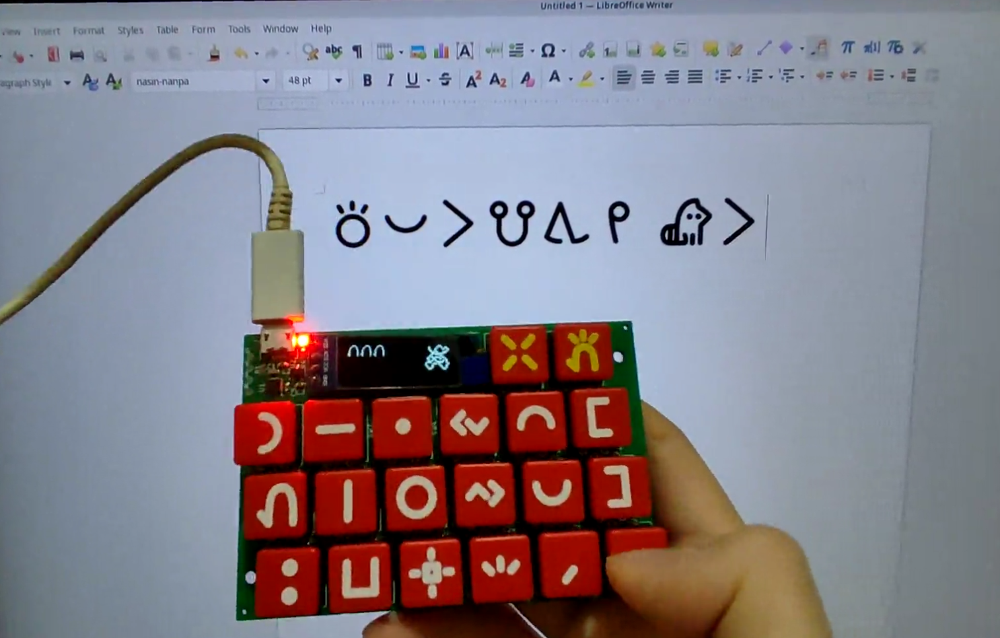

* o anu e toki (Language Selection): **[toki pona](README.MD)** | [toki ike Inli (English)](README-EN.MD)

# ilo nena - ilo pi nasin sitelen Wakalito



ilo nena ni li ken pali e sitelen pona tawa ilo sona kepeken nasin sitelen Wakalito. ilo nena la:

* nasin sitelen Wakalito li lon insa ona
* ken pana e sitelen pona tawa ilo sona kepeken [nasin UCSUR pi sitelen pona](https://www.kreativekorp.com/ucsur/charts/sitelen.html)
* ona li lili. ni li suli ona: 102mm x 64mm x 18mm
* jan li ken pana e sona sin tawa ona kepeken nasin "USB"
* sona ali ona li lon. jan ali li ken lukin e ona li ante e ona li pali e ona
* jan li ken pali e ona mute kepeken mani lili kepeken tenpo lili

## nasin kepeken

sina wile kepeken ilo nena la o pali e ni lon ilo sona sina:

1. o kama jo e sitelen "[FairFax HD](https://www.kreativekorp.com/software/fonts/fairfaxhd/)"
2. ilo sona sina li kepeken nasin seme?
	* 🪟 nasin lupa "Windows": o kama jo e ilo [WinCompose](https://github.com/ell1010/wincompose). ilo nena li kepeken nena "R_ALT+U+NANPA".
	* 🐧 nasin soweli "Linux": o pali e ala. ilo nena li kepeken nena "CTRL+SHIFT+U+NANPA"
	* 🍎 nasin kili "Mac OS": o kama jo e nasin "Unicode Hex Input" lon ilo sona sina. ilo nena li kepeken nena "Option+NANPA"
	* nasin ante: ilo nena li ken pana e sitelen Lasin e sitelen UCSUR ala.
3. o kepeken linja "USB". kepeken linja ni la ilo sona sina en ilo nena li kama wan. kin la ilo nena li kama jo e wawa
4. o pilin awen e nena pi nimi ala. sina pilin e ona la o weka ala e palisa luka sina. sina kama lon ma ni la sina ken anu e nasin. o anu e nasin sama nasin pi ilo sona sina:
	* 
	* sina ken anu e nasin kepeken nena "luka". sina pini la o pilin e nena "pana"
5. o open e ilo sitelen lon ilo sona sina. o kepeken sitelen "FairFax HD". ni la sina ken pana e sitelen pona kepeken ilo nena a!
6. (ken) tenpo ali la sina kepeken ilo sona pi nasin sama la, sina ken pali e ni:
	* o weka e wawa tan ilo nena sina
	* o pilin awen e nena "weka". ni la o pana e wawa tawa ilo nena. o weka ala e palisa luka sina.
	* o anu e nasin kepeken nena "luka" en nena "la". sina pini la o pilin e nena "pana"
	* wawa li weka la sona pi nasin sina li weka ala

## sona seme li lon?

```
bootloader/     # kepeken sona ni la sina ken pana e sona sin tawa ilo nena kepeken nasin "USB"
enclosure/      # selo
keycap_label/   # sitelen lon nena
kicad/          # lipu kiwen sona. ilo nena li jo e lipu kiwen. jan li pana e sona tawa ona la ilo nena li ken pali.
src/            # kepeken sona ni la ilo nena li pali. ilo nena li lukin e nena li pana e sitelen tawa ilo sona.
user_manual/    # jan li lukin e ona la jan ni li kama sona e ilo nena li ken kepeken ona.
```

## jan pona pi ilo nena

jan Sate li pali e ilo nena. taso jan ni li lon ala la ilo nena li ken ala lon:

* jan Sonja li pali e [toki pona](https://en.wikipedia.org/wiki/Toki_Pona)
* jan Likipi en kala pona Tonyu en jan Tepo li pali e [nasin sitelen Wakalito](https://sona.pona.la/wiki/Wakalito)
* jan Osi li pali e [sitelen leko lili](https://toki.pona.billsmugs.com/lipu-tenpo/2022-05-15-sitelen_pona/). sitelen pi ilo nena mi li kepeken ona.
* jan ali pi toki pona. sina kin! :-)

jan ni li pona mute tawa ilo nena. pona tawa sina ali!

## ken

lipu anpa ni li mi ala. sina wile lukin e ken ona la o lukin e nimi insa sitelen insa ona:

* src/usb_config.h
* src/generated.c

mi pali e lipu ante ali. ken ona li ken "BSD 2-clause".

## License (mi kepeken toki Inli kin tan ni: ni li ijo suli)

The following files are adapted from external soruces. Please read the comment inside the files to view the license information:

* src/usb_config.h - Adapted from MIT license source.
* src/generated.c - Contains font and strings generated from external files

All other files are my own and they're licensed under BSD 2-clause license.
