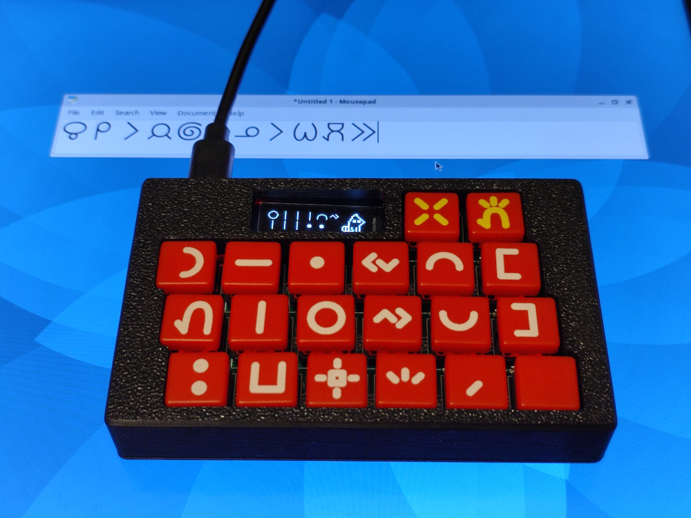
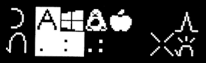

** (English: Scrolldown for English | toki Inli li lon anpa pi toki pona) **

# ilo nena - ilo pi nasin sitelen Wakalito



ilo nena ni li ken pali e sitelen pona tawa ilo sona kepeken nasin sitelen Wakalito. ilo nena la:

* nasin sitelen Wakalito li lon insa ona
* ken pana e sitelen pona tawa ilo sona kepeken [nasin UCSUR pi sitelen pona](https://www.kreativekorp.com/ucsur/charts/sitelen.html)
* ona li lili. ni li suli ona: 102mm x 64mm x 18mm
* jan li ken pana e sona sin tawa ona kepeken nasin "USB"
* sona ali ona li lon. jan ali li ken lukin e ona li ante e ona li pali e ona
* jan li ken pali e ona mute kepeken mani lili kepeken tenpo lili

## nasin kepeken

sina wile kepeken ilo nena la o pali e ni lon ilo sona sina:

1. o kama jo e sitelen "[FairFax HD](https://www.kreativekorp.com/software/fonts/fairfaxhd/)"
2. ilo sona sina li kepeken nasin seme?
	* 🪟 nasin lupa "Windows": o kama jo e ilo [WinCompose](https://github.com/ell1010/wincompose). ilo nena li kepeken nena "R_ALT+U+NANPA".
	* 🐧 nasin soweli "Linux": o pali e ala. ilo nena li kepeken nena "CTRL+SHIFT+U+NANPA"
	* 🍎 nasin kili "Mac OS": o kama jo e nasin "Unicode Hex Input" lon ilo sona sina. ilo nena li kepeken nena "Option+NANPA"
	* nasin ante: ilo nena li ken pana e sitelen Lasin e sitelen UCSUR ala.
3. o kepeken linja "USB". kepeken linja ni la ilo sona sina en ilo nena li kama wan. kin la ilo nena li kama jo e wawa
4. o pilin awen e nena pi nimi ala. sina pilin e ona la o weka ala e palisa luka sina. sina kama lon ma ni la sina ken anu e nasin. o anu e nasin sama nasin pi ilo sona sina:
	* 
	* sina ken anu e nasin kepeken nena "la". sina pini la o pilin e nena "pana"
5. o open e ilo sitelen lon ilo sona sina. o kepeken sitelen "FairFax HD". ni la sina ken pana e sitelen pona kepeken ilo nena a!
6. (ken) tenpo ali la sina kepeken ilo sona pi nasin sama la, sina ken pali e ni:
	* o weka e wawa tan ilo nena sina
	* o pilin awen e nena "weka". ni la o pana e wawa tawa ilo nena. o weka ala e palisa luka sina.
	* o anu e nasin kepeken nena "la" en nena "luka". sina pini la o pilin e nena "pana"
	* wawa li weka la sona pi nasin sina li weka ala

## nasin pi ante sona

sina ken pana e sona sin tawa ilo nena kepeken ilo "[minichlink](https://github.com/cnlohr/ch32fun/tree/master/minichlink)" kepeken nasin ni:

1. ilo nena sina o jo ala e wawa.
2. o pilin awen e nena "pana". o weka ala e luka sina.
3. o pana e wawa tawa ilo nena sina kepeken ilo sona sina
4. tenpo ni la ilo nena sina li sitelen e ala lon ma sitelen ona. ni li pona.
5. o kepeken ilo minichlink lon ilo sona sina: `./minichlink -w /ma/pi/sona_sin_sina.bin 0x08000000 -b`

## sona seme li lon?

```
bootloader/      # kepeken sona ni la sina ken pana e sona sin tawa ilo nena kepeken nasin "USB"
cardboard_label/ # sitelen poki
enclosure/       # selo
keycap_label/    # sitelen lon nena
kicad/           # lipu kiwen sona. ilo nena li jo e lipu kiwen. jan li pana e sona tawa ona la ilo nena li ken pali.
src/             # kepeken sona ni la ilo nena li pali. ilo nena li lukin e nena li pana e sitelen tawa ilo sona.
user_manual/     # jan li lukin e ona la jan ni li kama sona e ilo nena li ken kepeken ona.
```

## jan pona pi ilo nena

jan Sate li pali e ilo nena. taso jan ni li lon ala la ilo nena li ken ala lon:

* jan Sonja li pali e [toki pona](https://en.wikipedia.org/wiki/Toki_Pona)
* jan Likipi en kala pona Tonyu en jan Tepo li pali e [nasin sitelen Wakalito](https://sona.pona.la/wiki/Wakalito)
* jan Osi li pali e [sitelen leko lili](https://toki.pona.billsmugs.com/lipu-tenpo/2022-05-15-sitelen_pona/). sitelen pi ilo nena mi li kepeken ona.
* jan ali pi toki pona. sina kin! :-)

jan ni li pona mute tawa ilo nena. pona tawa sina ali!

## ken

lipu anpa ni li mi ala. sina wile lukin e ken ona la o lukin e nimi insa sitelen insa ona:

* bootloader/bootloader.bin
* src/usb_config.h
* src/generated.c

mi pali e lipu ante ali. ken ona li ken "BSD 2-clause".

# ilo nena - Toki Pona Unicode Keyboard with Built-in Wakalito Input Method


ilo nena is a purpose-built keyboard for typing sitelen pona glyph of toki pona into computers. Feature list:

* Built-in [Wakalito](https://sona.pona.la/wiki/Wakalito) input method
* Supports Unicode output with [sitelen pona UCSUR codepoints](https://www.kreativekorp.com/ucsur/charts/sitelen.html)
* Compact form factor: 102mm x 64mm x 18mm
* Supports firmware upgrade via USB
* Fully open source (firmware, PCBA, enclosure, user manual, etc.)
* Cost-optimized for small volume production. Easy to build your own unit

## Usage

1. Install the font "[FairFax HD](https://www.kreativekorp.com/software/fonts/fairfaxhd/)"
2. Which operating system are you using?
	* 🪟 Windows: Install [WinCompose](https://github.com/ell1010/wincompose). ilo nena uses "R_ALT+U+digits" to type Unicode
	* 🐧 Linux: Supported out of the box for most linux distros. ilo nena uses "CTRL+SHIFT+U+digits"
	* 🍎 Apple: Configure and use the built-in "Unicode Hex Input". ilo nena uses "Option+digits"
	* Others: ilo nena has Latin (ASCII) mode that's compatible with all devices. However, it couldn't output Unicode in this mode. You would need a font that supports conversion between Latin to sitelen pona such as FairFax Pona HD.
3. Connect USB cable, one side with ilo nena, another side with your computer
4. Hold the space key to enter the config screen below:
	* 
	* press the "la" key (leftmost column, topmost row) to select the OS. Once done, press the "pana" key (the yellow key on the rightmost column)
5. Launch any text editing software and select the font "FairFax HD". You're all set! Now that you can type sitelen pona with ilo nena!
6. (Optional) Here's how you set the default OS to use upon powering on the ilo nena:
	* Remove power from ilo nena
	* Hold the "weka" key (the yellow key on second column to the right) and connect USB cable.
	* Select configuration with the "la" key and the "luka" key (leftmost column, central row). After you're done, press the "pana" key
	* Your default settings is saved to ilo nena and preserved across power cycles

## Firmware Update

Firmware update can be performed via USB with "[minichlink](https://github.com/cnlohr/ch32fun/tree/master/minichlink)". Instruction:

1. Remove power from ilo nena
2. Hold the "pana" key (the yellow key on the rightmost column)
3. Connect USB cable, one side to your computer, another side to ilo nena
4. While in firmware update mode, the display of ilo nena would show nothing, which is intended
5. Run this command on your computer: `./minichlink -w /path/to/firmware.bin 0x08000000 -b`

## Repo Structure

```
bootloader/      # Bootloader for providing USB firmware update functionality (a patch against rv003usb)
cardboard_label/ # Label slapped onto the packaging cardboard
enclosure/       # The 3D printed enclosure design
keycap_label/    # The keycap label design printed onto UV DTF transfer sheet
kicad/           # Electronics design
src/             # Firmware source code
user_manual/     # User manual source and PDF
```

## Credits

ilo nena was developed by Sadale (jan Sate). This project wouldn't have been possible without the following prior works:

* jan Sonja: Created [Toki Pona langauge](https://en.wikipedia.org/wiki/Toki_Pona)
* jan Likipi, kala pona Tonyu and jan Tepo: Developed [Wakalito](https://sona.pona.la/wiki/Wakalito) input method for sitelen pona
* jan Osi: Created the public domain font [sitelen leko lili](https://toki.pona.billsmugs.com/lipu-tenpo/2022-05-15-sitelen_pona/), which's embedded into ilo nena
* All of the Toki Pona speakers around the world! This product's useless without a solid community! :-)

For all of the people above, you have my gratitude. Thank you very much!

## License

The following files are adapted from external sources. Please read the comment inside the files to view the license information:

* bootloader/bootloader.bin - Built from MIT license source
* src/usb_config.h - Adapted from MIT license source
* src/generated.c - Contains font and strings generated from external files

All other files are my own and they're licensed under BSD 2-clause license.
