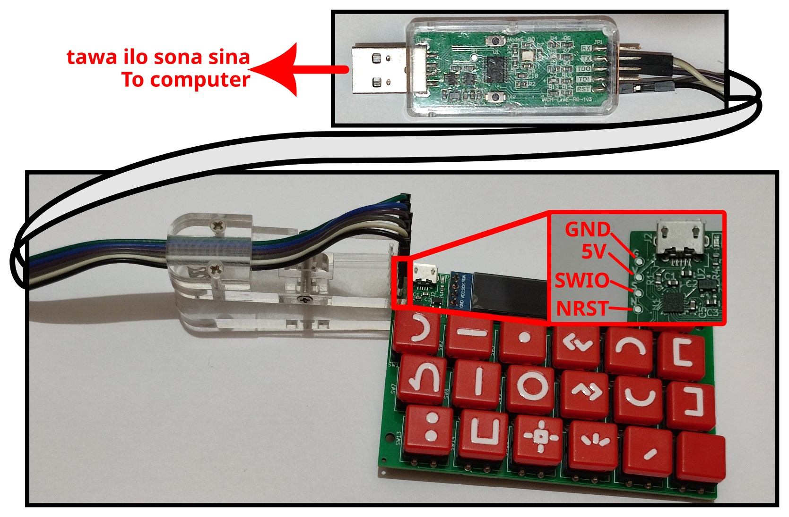

** (English: Scrolldown for English | toki Inli li lon anpa pi toki pona) **

# ilo "Bootloader" li seme?

* kepeken ilo ni la jan li ken pilin e nena "pana" li pana e sona sin tawa ilo nena kepeken nasin "USB".
* lipu `bootloader.patch` li ante e lipu ni kepeken ilo `git apply`: https://github.com/cnlohr/rv003usb/tree/35e0f688a9a041ed8cec37fcbb458df095dc0d79 ni la sina ken pali e lipu `bootloader.bin`
* tenpo pini la mi kin li pali e lipu `bootloader.bin`. sina ken kepeken e ona e lipu `bootloader.patch` ala.
* sina ken pana e ilo ni tawa ilo nena kepeken ilo tu ni lon tenpo sama: ilo "WCH-LinkE" en ilo "minichlink". o kepeken nimi ni: `./minichlink -a -w bootloader.bin bootloader -B`
* kin la sina o kepeken nimi ni: `./minichlink -w +a55af708 option`. sina kepeken ala nimi ni la ilo ni li pali ala a!

## ken

jan Sate li pali ala e ilo ni. jan "CNLohr" li pali e ona. ken ona li ken "MIT License".

# Bootloader of ilo nena

* Provides USB flashing functionality by holding the "pana" key upon boot
* Requires WCH-LinkE to flash the bootloader itself
* `bootloader.patch` is to be applied with `git apply` against the following repo's commit: https://github.com/cnlohr/rv003usb/tree/35e0f688a9a041ed8cec37fcbb458df095dc0d79 . You can build `bootloader.bin` with it on your own. The patch enables the hold-button-to-enter-bootloader functionality.
* You can also use the `bootloader.bin` pre-built binary in this folder instead of building the bootloader on your own
* To flash, WCH-LinkE and minichlink are required. Run the following command after connecting ilo nena with WCH-LinkE: `./minichlink -a -w bootloader.bin bootloader -B`
* Contrary to the specs of CH32V003, I empirically found that it came with bootloader disabled (USER=0x17 instead of 0xF7). Please enable the bootloader with the following command: `./minichlink -w +a55af708 option`

## License

I'm not the author of the bootloader. It's created by CNLohr released under MIT License.
