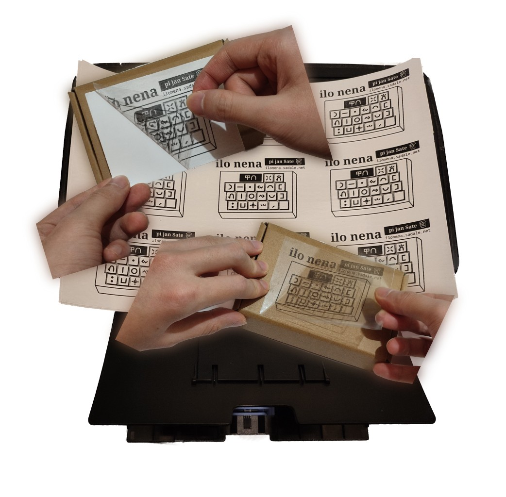
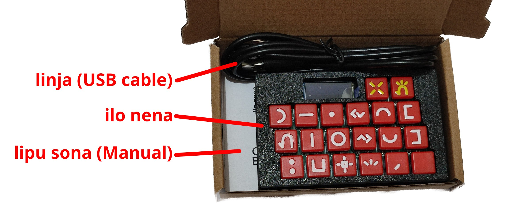

**(English: Scrolldown for English | toki ike Inli li lon anpa pi toki pona)**

# sitelen poki

sitelen ni li lon poki pi ilo nena. nasin kepeken:

1. o kama jo e lipu pi suli "A4".
2. o pana e sitelen `cardboard_label.jpg` tawa lipu (lipu `cardboard_label.jpg` li tan lipu `cardboard_label.svg`)
3. lipu suli wan o kama lipu lili mute
4. o pana e lipu lili wan tawa poki wan. o pana e lipu lili nanpa tu tawa poki nanpa tu. ni la o kepeken lipu lili ali sina.

## o poki e ali!

poki li jo e ilo nena e lipu sona e linja USB MicroB (suli ona li 1.5m):

suli poki li ni: 130x80x25mm

# Cardboard Label

To print:

1. Get an A4-sized sticker that you can print on.
2. Print `cardboard_label.jpg` (Its source file is `cardboard_label.svg`)
3. Cut it into 9 pieces with a paper cutter
4. Put each of the stickers onto the surface of the cardboard

## Packing

Pack the items as shown on the photo way above. The package contains ilo nena unit, user manual and 1.5m USB microB cable. The cardboard's dimensions is "130x80x25mm".
