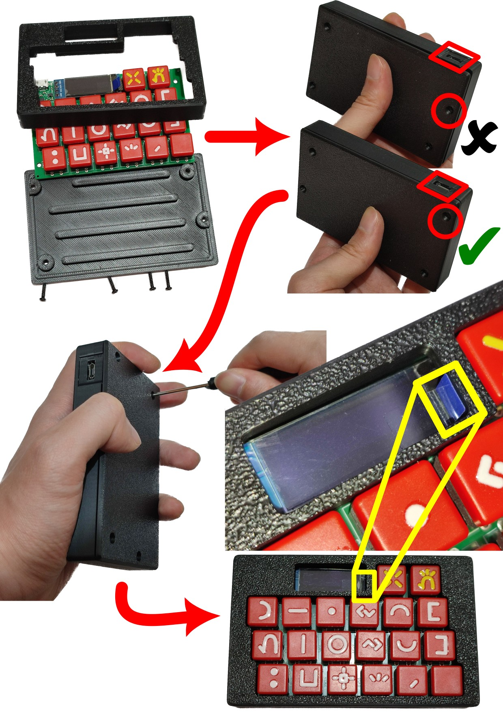

# selo

sina ken pali e selo kepeken ilo pi pali selo "3D printer". mi kepeken kiwen pimeja "ABS".

selo li jo e ijo tu. ijo `ilonena_enclosure-Bottom.stl` en ijo `ilonena_enclosure-Top_Rotated.stl`. sina ken pali e selo kepeken nasin ni:

1. o kama jo e palisa "PA2.3x10" tu tu.
2. o sike ala e ijo `ilonena_enclosure-Bottom.stl`
3. o pana e lipu sona insa selo. o wan e ali kepeken palisa "PA2.3x10". kin la o sewi lili e lipu pi ilo sitelen.

sina ken ante e selo ni kepeken lipu `ilonena_enclosure.FCStd`.

# Enclosure

The STL files can be manufactured by using 3D printer.

The material I used is black ABS. I outsourced to a 3D printing service provider.

Here's the assembly procedure:

1. Obtain four PA2.3x10 self-tapping screws
2. Mind the orientation of the `ilonena_enclosure-Bottom.stl`
3. Sandwich the PCBA between the two enclosure parts and install the four screws with a screw driver. Make sure to position the tip of the screen protection film of the OLED such that it can be peeled off.

See the pic way above for the assembly procedure. `ilonena_enclosure.FCStd` is the source file that you can modify.
