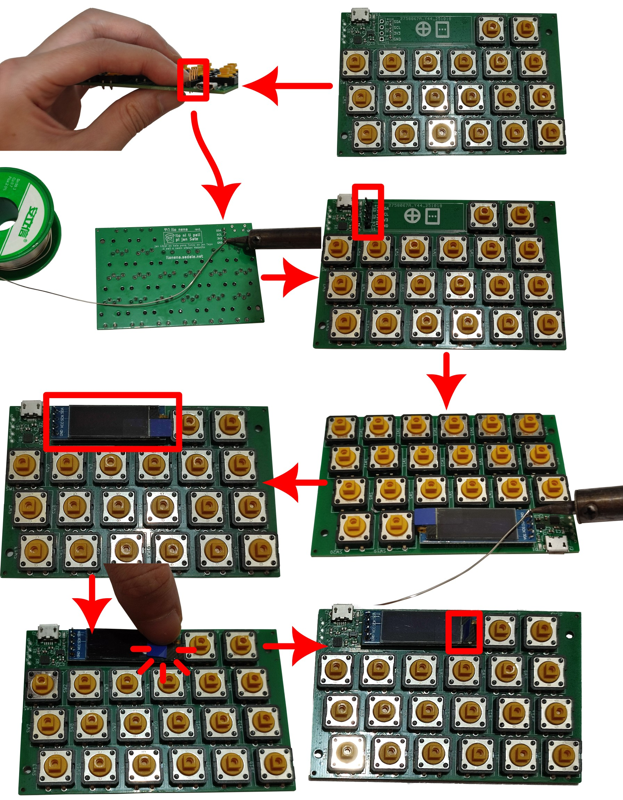

**(English: Scrolldown for English | toki ike Inli li lon anpa pi toki pona)**

# lipu kiwen sona

ma ni li jo e sona pi lipu kiwen. mi pali e ona kepeken ilo "KiCad" en ilo lili "[Fabrication-Toolkit](https://github.com/bennymeg/Fabrication-Toolkit)".

sina ken esun e lipu kiwen sona kepeken nasin ni:

1. o open e lipu `production.zip`
2. insa lipu `production.zip` la o pana e ni tawa tomo pali: lipu `ilonena.zip` li lipu "gerber". lipu `bom.csv` en lipu `positions.csv` li lipu "SMT". mi kepeken tomo pali "JLCPCB".
3. o pana e mani tawa tomo pali. ni la sina o awen. lipu kiwen sona li jo e ijo mute. taso ilo sitelen li lon ala.

o pana e ilo sitelen tawa lipu kiwen sona kepeken nasin ni:

1. o esun e ilo sitelen e palisa kulupu. nimi pi ilo sitelen li ni: SSD1306 128x32 0.91" OLED I2C
2. o pana e palisa kulupu tawa lipu kiwen sona
3. o pana e ilo sitelen lon sewi pi palisa kulupu.
4. o pana e wawa tawa lipu lili pi ilo sitelen

# PCBA Source and Production Files

This folder contains the source and production files for the PCBA of ilo nena. It uses KiCad with production files generated with the plugin "[Fabrication-Toolkit](https://github.com/bennymeg/Fabrication-Toolkit)".

To order PCBA on your own:

1. Extract `production.zip`
2. Inside the extracted files, send `ilonena.zip` as gerber. `bom.csv` and `positions.csv` as SMT files. I used JLCPCB for the PCBA.
3. Pay up and wait for delivery. The PCBA has all electronic parts except for the OLED screen, which you need to solder that on your own.

Soldering the OLED:

1. Purchase SSD1306 128x32 0.91" OLED I2C and its 2.54mm 4p pin header
2. Solder the pin header onto the board with a soldering iron.
3. Solder the OLED on top of the pin header.
4. Fold the peeling tab of the OLED so that it would be exposed and accessible thru the enclosure
