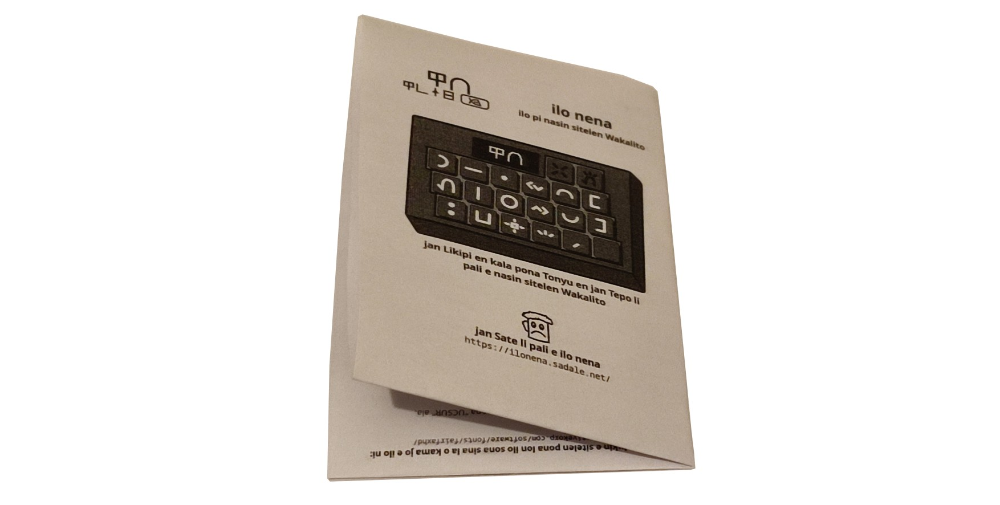

**(English: Scrolldown for English | toki ike Inli li lon anpa pi toki pona)**

# lipu sona

sina ken pali e lipu sona kepeken nasin ni:

1. o kama jo e lipu pi suli "A5". sina tu e lipu "A4" wan la ona li kama lipu "A5" tu.
2. o pana e `lipu_sona.pdf` tawa lipu "A5" sina.
3. o lili e lipu kepeken luka sina. lipu sona li kama lon:

lipu sona li lukin ike la o ante e lipu `lipu_sona.pdf` kepeken nasin ni:

1. o open e lipu `lipu_sona.odt` kepeken ilo "LibreOffice"
2. o pilin e nena "File > Print"
3. o ante e nanpa lon ma ni:

4. o pilin e nena "Print to file". ni la lipu "PDF" sin li kama.
5. o kepeken lipu "PDF" sin. ona li lukin ike o awen ante e nanpa kepeken nasin sama.

# Paperback User Manual

To print:

1. Get an A5-sized paper. It can be obtained by cutting A4-sized paper into two-halves.
2. Print `lipu_sona.pdf` with margin added to the edge.
3. Fold the user manual twice as shown on the photo way above (in the toki pona version of the instruction)

The required margin varies between different printers and OS configurations. Here's how to adjust the margin in case the user manual looked wrong:

1. Open `lipu_sona.odt` with LibreOffice
2. Click on File > Print
3. Adjust the margin as shown in the screenshot way above (in the toki pona version of the instruction)
4. Click on "Print to file" to generate a PDF file with correct margin.
5. Print out the PDF file and see if the margin is correct. If not, adjust the margin again until you got it right.
